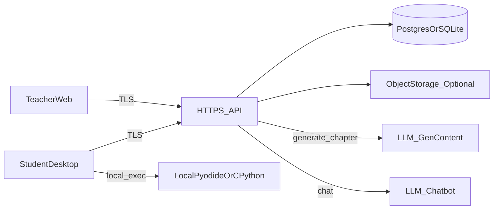

# AI + Python 教学系统 — 设计规格

**状态**：草案 v1，与 [准备清单](2026-04-23-ai-python-teaching-system-preparation.md) 对齐。  
**维护**：单人。  
**日期**：2026-04-23

---

## 1. 目标与边界

| 做 | 不做 |
|----|------|
| 学生 **Win/Mac 桌面** 学章、Notebook 式 cell 练习、**过关**、**章完成** 提交 | 作业/考试 **打分**、成绩导出、**防抄袭**、**转班** |
| 教师 **仅 Web**、**管理员密码**（无教师注册表）、**名单预导入**、**章内容编辑**、**AI 草稿 人审 发布**、**看 章完成** 进度 | 微信/QQ 登录、**RAG**、云端 **JupyterHub**（一期） |
| **引导 cell** 带可跑提示、**扩展 cell** 不给完整标答、**随时 Chatbot** | 教师 在 系统 内 逐题 批改 |

---

## 2. 系统上下文



- **学生端**：内嵌 **JupyterLite/Pyodide** 和/或 **本机 CPython 子进程**；执行**不**为云端共享内核。  
- **教师端**：**静态/SSR SPA** 调 **同域** API。  
- **数据**：**PostgreSQL**（推荐生产）或 **SQLite**（早期单机）；**章 JSON** 可存 `TEXT` / `JSONB` 列。

---

## 3. 身份与凭据

### 3.1 教师（管理员）

- **表** `admin_config` 单行：`password_hash`（**bcrypt/argon2**，**不可逆**），`updated_at`。  
- **无** 独立 `teachers` 多行 注册；**可** 后续加 `admin_email` 仅作 展示 非 登录 名。  
- **会话**：**HTTP-only Secure Cookie** 或 **短效 JWT**（`HttpOnly`），`teacher_session`。

### 3.2 学生

- **表** `students`：`id`（UUID）, `student_no`（唯一）, `full_name`（与导入一致）, `password_ciphertext`（**AES-256-GCM** 或 库封装）, `password_key_id`（若轮换 DEK）, `created_at`。  
- **可逆**：`design` 实现里 **KMS/环境** `STUDENT_PASSWORD_ENCRYPTION_KEY`（**32 字节** base64），**不** 进 Git。  
- **会话**：**JWT** `sub=student_id`，**短效** + **刷新** 策略在实现 中 定。  
- **首登绑定**：`roster` 行 **PENDING** → 匹配 **学号+姓名** → 设密码 → **ACTIVE**。

### 3.3 名单

- **表** `roster_entries`：`student_no`, `full_name`（**复合唯一** 或 以 `student_no` 唯一 视产品），`status`（`pending`|`bound`），`student_id`（**可空**，绑定 后 填）。

---

## 4. 章节与内容模型

### 4.1 章

- **表** `chapters`：`id`, `slug`, `title`, `order`, `content_status`（`draft`|`published`）, `source_material`（**原始 素材 文本/路径**）, `ai_generated_draft`（**JSON 可空**）, `published_content`（**JSON 定稿**）, `updated_at`。  
- **发布**：仅 `published_content` 对 学生 可读；`draft` 对 教师 可编辑。

### 4.2 JSON 总形状（`published_content`）

根对象 至少：

```json
{
  "version": 1,
  "blocks": [
    {
      "id": "blk-uuid",
      "knowledgeHtml": "<p>...</p>",
      "guideCell": { "id": "c1", "starterCode": "print('hi')", "description": "..." },
      "extensionCell": { "id": "c2", "promptHtml": "...", "starterCode": null }
    }
  ]
}
```

- **规则**：`extensionCell.starterCode` **必须** 为 `null` 或 **非** 可抄 **完整 解**（**校验器** 在 保存/发布 时 跑 启发式/长度/黑名单；**不** 保证 100% 防 泄漏，人审 为主）。  
- **过关**：每 cell 有 `id`；客户端 上报 `{chapterId, cellId, runOk: bool, error?: string}`。  
- **必做 集合** = 每 block 的 `guideCell` + `extensionCell` 的 `id` 展开；**全 为 runOk** 后 **可** 调 **章完成** API。

### 4.3 AI 生成 流水线

- **入参**：`source_material` 字符串（或 上传 文件 引用）。  
- **出参**：与 上 述 **JSON** 同 形 **draft**；**不** 自动 **发布**。  
- **表** 或 字段：`ai_generated_draft` + `content_status=draft`；**教师 编辑 后** 写入 `published_content` 并 `published`。  
- **Prompt**：独立 `config/prompts/chapter-generate.v1.md` 或 库 中 常量，**不** 含 密钥。  
- **防呆**：`extensionCell.starterCode` 若 模型 填 了 长 代码，**发布 前** **API** 可 **置 null** 或 **拒绝 发布** 并 提示。

---

## 5. 执行栈（学生端）

| 模式 | 何时 | 行为 |
|------|------|------|
| `pyodide` | 标库/轻 依赖 | 内嵌 `jupyterlite` 或 直接 `pyodide` 跑 cell |
| `cpython` | 需 `pip` / C 扩展 | **本机** 子进程、**可写** `venv` 目录、**pip 全开放**、**可配 镜像** `PIP_INDEX_URL` |

- **元数据 每 章/每 cell 可选** `executionMode`：`"pyodide"` | `"cpython"`（**默认** `pyodide`）；人审 时 与 课 对齐。  
- **资源**：`exec_timeout_ms`、**CPU** 软 限制（`design` 实现 中 用 **超时 kill** 为主）。

---

## 6. API 草图（REST，HTTPS）

**前缀** `/v1`。**鉴权** `Authorization: Bearer`（学生）或 **Cookie**（教师，二选 一 在 实现 统一）。

| 方法 | 路径 | 说明 |
|------|------|------|
| POST | `/admin/bootstrap` | **首启** 设 管理员 密码（**仅 无 密码 时** 允许） |
| POST | `/admin/login` | 教师 登录 |
| GET | `/admin/roster` | 名单 列表 |
| POST | `/admin/roster/import` | CSV/JSON 导入 |
| GET | `/admin/chapters` | 章 列表（含 状态） |
| POST | `/admin/chapters` | 建章 草稿 |
| POST | `/admin/chapters/:id/generate` | 触发 **AI 生成** → 写 `ai_generated_draft` |
| PUT | `/admin/chapters/:id` | 更新 草稿/定稿 |
| POST | `/admin/chapters/:id/publish` | 发布 `published_content` |
| GET | `/student/chapters` | 学生 可见 **已发布** 章 |
| GET | `/student/chapters/:id` | 读 **章内容**（**无** 草稿 字段） |
| POST | `/student/register` | 学号+姓名+密码 绑定 |
| POST | `/student/login` | 登录 |
| POST | `/student/cells/verify` | `{chapterId, cellId, runOk, ...}` 幂等 记录 |
| POST | `/student/chapters/:id/complete` | 校验 **必做 全 过** 后 写 **章完成** |
| POST | `/student/chat` | **Chat** 流式/非 流，body 带 `chapterId` `cellId` `message` |
| GET | `/admin/progress` | 某章/全班 **完成 列表**（**可选**） |

**表** `cell_verifications`（**可** 仅存 **最新** 每 `student,chapter,cell`）：`run_ok`, `at`。  
**表** `chapter_completions`：`student_id`, `chapter_id`, `completed_at`（**唯一** 约束 防 重复 提交）.

---

## 7. Chatbot

- **无 RAG**；**系统 提示** 可 注入 当前 `cell` 题面 摘要。  
- **环境**：`CHAT_LLM_BASE_URL` + `CHAT_LLM_API_KEY`（**国内** 供应商 **TBD**）.  
- **对话 存储**：`chat_messages` 表 **可选**；**MVP 可 不落库** 仅 **审计 日志 文件**。

---

## 8. 部署

- **境外** 小 VM：Docker **Compose**（`api` + `db` + `caddy` **HTTPS**）.  
- **域名**：国内 买，**A** 记录 指 VM.  
- **密钥**：`.env` 或 容器 **env**，**不** 进 Git。  
- **学生 端**：**Tauri 或 Electron** 构建 安装 包，**点** 向 `API_BASE_URL`（`design` 或 构建 时 注入）。

---

## 9. 与 准备 清单 的 追溯

- **过 关 默认** **无 未 捕获 异常**；**扩展** 严 度 **+断言** 为 **M3 可选** 在 **同 API** 加 `assertion` 字段。  
- **人审** 必 过、**单 人** 维护 见 准备 清单。

---

## 10. 未决（实现 时 关）

1. 国内 **Chat/Gen** 是否 **同** 一 厂商.  
2. 学生 端 **Tauri 与** **Electron** 二选 一.  
3. **终稿 代码** 是否 存 对象 存储 备份（**默认可 不 存**）.

---

*下一步：见 [implementation plan](../plans/2026-04-23-ai-python-teaching-system-implementation.md)（按 `writing-plans` 技能书写）。*
