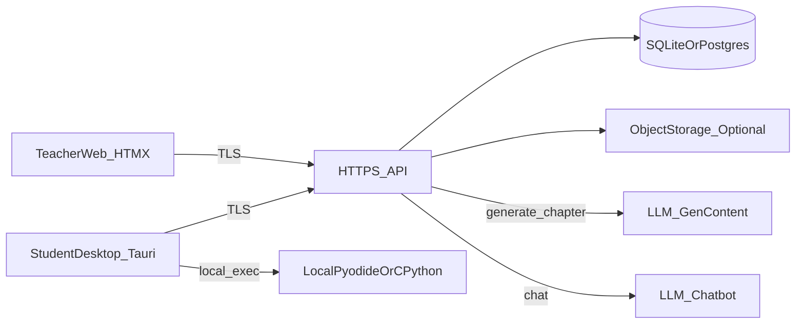

# AI + Python 教学系统 — 设计规格

**状态**：草案 v2，与 [准备清单](2026-04-23-ai-python-teaching-system-preparation.md) 对齐。  
**维护**：单人。  
**日期**：2026-04-23（v2 纳入计划评审定稿项）

---

## 1. 目标与边界

| 做 | 不做 |
|----|------|
| 学生 **Win/Mac 桌面** 学章、Notebook 式 cell 练习、**过关**、**章完成** 提交 | 作业/考试 **打分**、成绩导出、**防抄袭**、**转班** |
| 教师 **仅 Web**、**管理员密码**（无教师注册表）、**名单预导入**、**章内容编辑**、**AI 草稿人审发布**、**查看章完成**进度 | 微信/QQ 登录、**RAG**、云端 **JupyterHub**（一期） |
| **引导 cell** 带可跑提示、**扩展 cell** 不给完整标答、**随时 Chatbot** | 教师在系统内逐题批改 |

### 1.1 单人维护已选技术栈（减少分叉）

| 项 | 已定选择 | 说明 |
|----|----------|------|
| 数据库 | **SQLite** + WAL 起步；规模上来再评估 **PostgreSQL** | 单人运维最简；`docker-compose` 中 Postgres 为可选 |
| 教师 Web | **FastAPI + Jinja2 + HTMX**（同进程或挂在 `services/api`） | 少一条独立前端构建；**M2** 可换**可视化**章编辑器（块列表+表单） |
| 学生桌面 | **Tauri** 唯一 | 不以 Electron 为默认 |
| 生产 HTTPS | **Caddy** 自动证书 | 在 Traefik/Caddy 中已定 **Caddy** |
| 鉴权 | 教师 **HttpOnly+Secure 签名 Cookie**；学生 **Authorization: Bearer JWT** | **JSON 请求/响应体字段用 camelCase**；后端 Pydantic 用 `alias` |

---

## 2. 系统上下文



- **学生端**：**JupyterLite/Pyodide** 和/或 **本机 CPython 子进程**；**不**在云端跑共享内核。  
- **教师端**：**HTMX** 页面调**同域** API。  
- **数据**：**SQLite** 单文件，或 **PostgreSQL** 及 `JSONB`；`published_content` 亦可存 `TEXT`（JSON 字符串）。

---

## 3. 身份与凭据

### 3.1 教师（管理员）

- **表** `admin_config`（单行）：`password_hash`（**bcrypt**，不可逆），`updated_at`。  
- **不**建多行 `teachers` 注册表。  
- **会话**：**HttpOnly + Secure** 的签名 Cookie，键名如 `teacher_session`；**不**以教师端 Bearer 为默认（避免双模式分歧）。

### 3.2 学生

- **表** `students`：`id`（UUID）、`student_no`（唯一）、`full_name`、`password_ciphertext`、**`must_change_password`（BOOL，教师重置或首登临时密码时置 true）**、`created_at`。  
- **可逆存储**：环境变量 `STUDENT_PASSWORD_ENCRYPTION_KEY`（32 字节 base64），**不**进 Git。  
- **首登/绑定提示**（可选展示）：本系统密码**不要**与校外重要账号相同。  
- **会话**：JWT，`Authorization: Bearer`；**短效 + 刷新**在实现中确定。  
- **首登**：名单 `pending` → 学号+姓名**精确**匹配 → 设密 → `bound`；**无**邮箱/手机找回；**教师重置密码**后建议 `must_change_password=true`。

### 3.3 名单

- **表** `roster_entries`：**`student_no` 唯一**；`full_name` 仅用于首登**精确**匹配。录错由教师**软删/重导**，**不**用复合主键增加讨论成本。

### 3.4 教师查看学生明文密码与审计

- **展示解密密码**：须**再提交一次**当前管理员密码（body 或专用 header）通过校验后才返回。  
- **表** `admin_audit`：`id`、`at`（**UTC**）、`action`（如 `view_student_password`）、`target_student_id`、`ip`、`user_agent`。

---

## 4. 章节与内容模型

### 4.1 表 `chapters`

- 原有：`id`, `slug`, `title`, `order`, `content_status`, `source_material`, `ai_generated_draft`, `published_content`, `updated_at`  
- **新增**：`ai_generated_raw`（TEXT 可空，JSON 无法解析时原样存模型输出）、`generator_prompt_version`（如 `v1`）、`generator_model`（可空）  
- 生成失败或 JSON **不合法**时：可将 `content_status` 标为 `draft_invalid`，教师可见**错误提示**并对照 `ai_generated_raw` 手修

### 4.2 `published_content` JSON 与过关

根对象须含 **`"version": 1`**。将来 `version: 2` 须在文档 **CHANGELOG** 中说明与 v1 的兼容/迁移。

```json
{
  "version": 1,
  "blocks": [
    {
      "id": "blk-uuid",
      "knowledgeHtml": "<p>...</p>",
      "requiredExecutionMode": "pyodide",
      "guideCell": {
        "id": "c1",
        "starterCode": "print('hi')",
        "description": "...",
        "passRule": { "mode": "no_exception" }
      },
      "extensionCell": {
        "id": "c2",
        "promptHtml": "<p>说明期望输出</p>",
        "starterCode": null,
        "passRule": {
          "mode": "stdout_contains",
          "expectedSubstring": "Hello, Andrew"
        }
      }
    }
  ]
}
```

**`passRule.mode`（可扩展）**

| mode | 含义 | 说明 |
|------|------|------|
| `no_exception` | 无未捕获异常即过 | **引导题**默认 |
| `stdout_contains` | 标准输出包含子串 | 填 `expectedSubstring`；**扩展题推荐**，减少空 `pass` 蒙混 |
| `assert_snippet` | 在沙箱中追加执行断言代码 | 使用字段 `assertCode`（字符串） |
| 扩展题仅用 `no_exception` | 与准备清单最弱规则一致 | **不推荐**作扩展题主策略 |

**`POST /v1/student/cells/verify` 建议 body（camelCase）**：

```json
{
  "chapterId": "uuid",
  "cellId": "c2",
  "runOk": true,
  "stdout": "...",
  "stderr": "",
  "errorExcerpt": null,
  "elapsedMs": 120
}
```

- **表** `cell_verifications`：按 `student+chapter+cell` **只保留最新**一条；字段含 `run_ok`、`at`（**UTC**）、`stdout`（可截断）、`error_excerpt`（VARCHAR(500)）、`elapsed_ms`（可空）。服务端据 `passRule` 与上报警告算最终是否过关（实现见 API 层）。

### 4.3 AI 生成契约

- 入参：`source_material` 或上传文件引用。  
- 出参：与 **§4.2** 同形草稿；`extensionCell.starterCode` **以 null 为主**；扩展题须带**合理** `passRule`（在 **Prompt** 中强制）。  
- **Pydantic** 校验失败：写入 `ai_generated_raw`，`content_status=draft_invalid`，**不**自动写 `published_content`。  
- **Prompt** 文件：`config/prompts/chapter-generate.v1.md`，与 `generator_prompt_version` 一致。  
- 失败/429：**指数退避重试**；错误信息可对教师可读展示。

---

## 5. 学生端执行栈

| 模式 | 何时 | 行为 |
|------|------|------|
| `pyodide` | 标库/轻量、**不**做任意 `pip` | 内嵌 **Pyodide** |
| `cpython` | 要 `pip` 或 C 扩展 | **本机**子进程、可写 `venv`、**pip 全开放**、环境变量 `PIP_INDEX_URL` 可配国内镜像 |

- **Block** 上可选 **`requiredExecutionMode`**: `"pyodide"` | `"cpython"`，人审与课程一致；首屏可**提示**本章需本机模式。  
- **资源**：`exec_timeout_ms`、超时 **kill**。

---

## 6. API 草图（**HTTPS，前缀 `/v1`**）

- **学生**：`Authorization: Bearer <JWT>`  
- **教师**：`Cookie: teacher_session=...`（**默认不**用教师 Bearer）

| 方法 | 路径 | 说明 |
|------|------|------|
| POST | `/admin/bootstrap` | 首启设置管理员密码 |
| POST | `/admin/login` | 登录，**Set-Cookie** |
| GET | `/admin/roster` | 名单 |
| POST | `/admin/roster/import` | 导入 |
| POST | `/admin/students/:id/reveal-password` | 须再验管理员密码 + 写 **admin_audit** |
| GET/POST | `/admin/chapters` 等 | 建稿、编辑、**generate**、**publish**（与设计 §4.1 一致） |
| GET | `/student/chapters` | 已发布章列表 |
| GET | `/student/chapters/:id` | 读章（**无**草稿内部字段） |
| POST | `/student/register`、`/student/login` | 见 §3 |
| POST | `/student/cells/verify` | 见 **§4.2**；服务端**根据** `passRule` 判定 |
| POST | `/student/chapters/:id/complete` | 必做 cell 全过关后写 **chapter_completions** |
| POST | `/student/chat` | 题面+用户代码在服务端**截断**至 `CHAT_CONTEXT_MAX_CHARS` 再组提示 |
| GET | `/admin/progress` | 完成进度（可选） |

`chapter_completions`：`(student_id, chapter_id)` 唯一；`completed_at` 为 **UTC**。

---

## 7. Chatbot

- **无 RAG**；**上下文截断**防整章外泄、控制费用。  
- 环境变量：`CHAT_LLM_BASE_URL`、`CHAT_LLM_API_KEY`；章生成可独立 `CHAPTER_GEN_*`（是否同厂**实现时**定）。  
- MVP 对话**可不落库**；**文件审计日志**可替代。

---

## 8. 部署与运维

- 境外小 VM：`docker-compose`：`api` + 可选 `postgres` + **Caddy**；**纯 SQLite** 时 `api` 挂 **data** 数据卷。  
- **备份**：每日 `sqlite3 .backup` 或 `pg_dump`；**导出**名单/完成**CSV**（脚本见**实现计划 Task 0**）。  
- **时间**：DB 存 **UTC**；Web/学生端**展示**为本地时区。  
- **学生端首启**：一页**使用说明 + 数据收集告知**（学号、对话、错误片段等），**同意**后进入。  
- 学生端 **Tauri** 打包；`API_BASE_URL` 构建/配置注入。

---

## 9. 限流与 pip（一期最小可用）

- **Chat**：每生每分钟 N 次、每日 token 上限（环境变量）。  
- **pip**：保持**全开放**；可选**包名黑名单**（环境变量列表）。

---

## 10. 与准备清单的对应

- **过关**：引导题以 `no_exception` 为主；**扩展题**优先 `stdout_contains` 或 `assert_snippet`（**§4.2**）。  
- **M3 可选**：更强沙箱等；**JupyterHub** 仍非默认。

---

## 11. 未决（已收敛；其余上文已定）

1. **Chat** 与 **章生成** 是否同一厂商（可两套独立 **env**）。  
2. **终稿代码**是否上对象存储备份（**默认不存**）。

---

*下一步：[implementation plan](../plans/2026-04-23-ai-python-teaching-system-implementation.md)（已与 v2 对齐）。*
